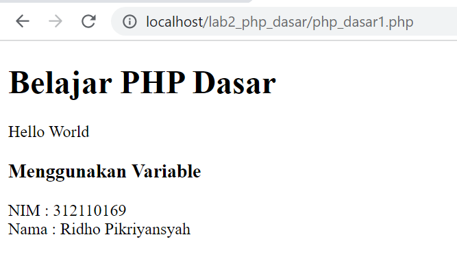
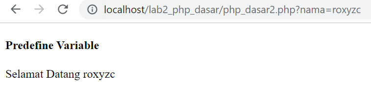
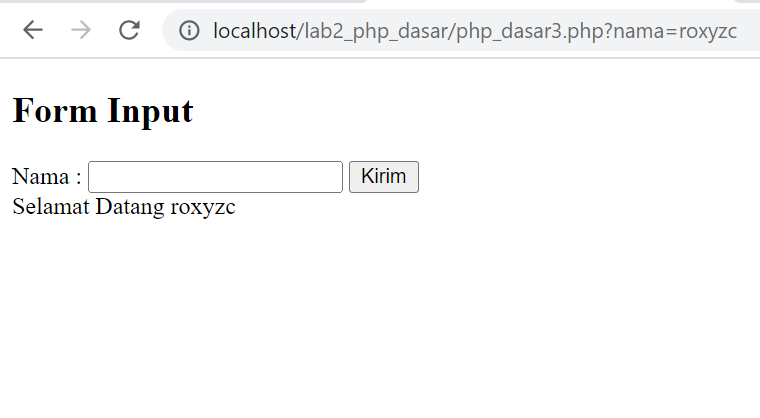
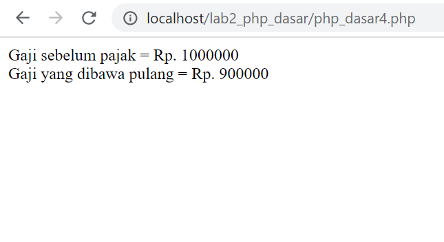
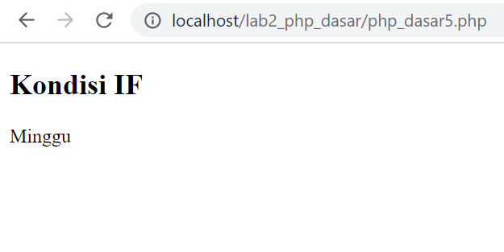
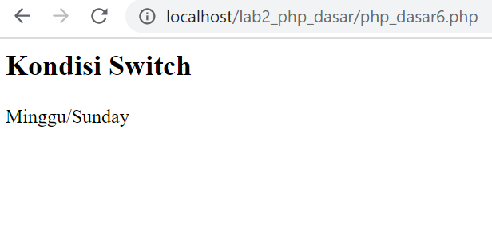
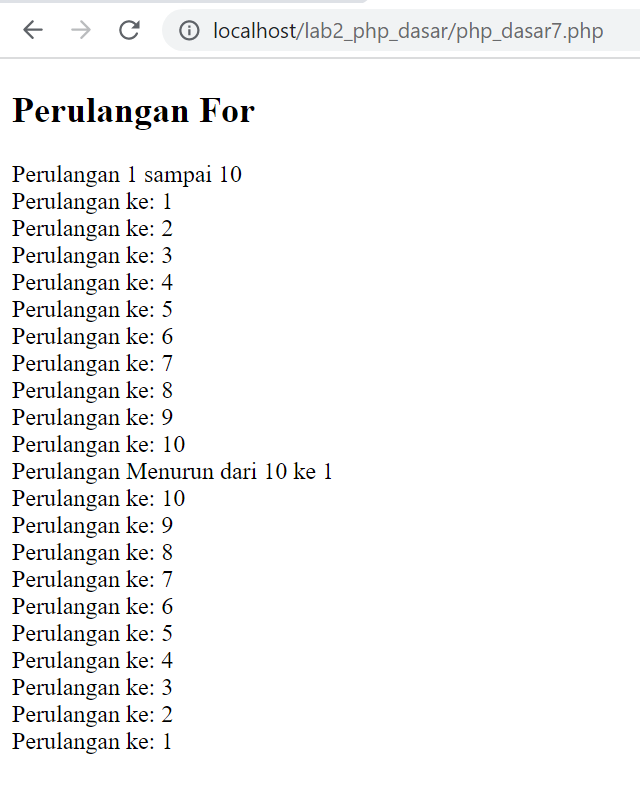
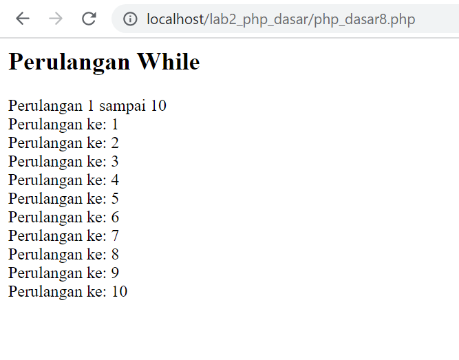
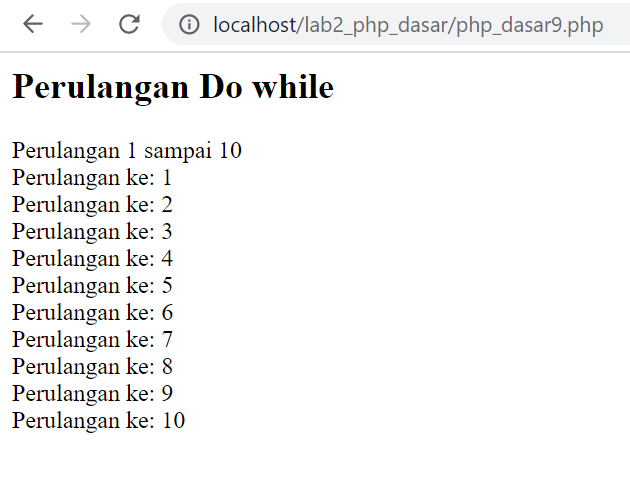

# TUGAS Lab2Web

## Latihan ke 1

### **Code**
```
<body>
    <h1>Belajar PHP Dasar</h1>
    <?php
    echo "Hello World<br>";

    $nim = "3121101169";
    $nama = "roxyzc";
    echo "Nim: " . $nim . "<br>";
    echo "Nama: " . $nama;
    ?>
</body>
```
### **Output**
<br><br>

### **Penjelasan**
>Code diatas merupakan contoh untuk memasukkan value kedalam variabel nama dan nim, setelah itu dilanjutkan dengan menampilkan value kedalam browser

## Latihan ke 2

### **Code**
```
<body>
  <!-- Variabel $_GET -->
  <h4>Predefine Variable</h4>
  <?php
  echo 'Selamat Datang ' . $_GET['nama']
  ?>
</body>
```

### **Output**


### **Penjelasan**
>Code diatas merupakan contoh untuk mendapatkan value dari query 'nama'

## Latihan ke 3

### **Code**
```
<body>
  <h2>Form Input</h2>
  <form method="post">
    <label>Nama : </label>
    <input type="text" name="nama">
    <input type="submit" value="Kirim">
  </form>
  <?php
  if (isset($_GET["nama"])) {
    echo "Selamat Datang " . $_GET["nama"];
  }
</body>
```
### **Output**


### **Penjelasan**
>Code diatas merupakan contoh untuk mengirimkan value dari form dengan method post dan kemudian diambil menggunakan query `nama`

## Latihan ke 4

### **Code**
```
<body>
  <?php
  $gaji = 1000000;
  $pajak = 0.1;
  $thp = $gaji - ($gaji * $pajak);
  echo "Gaji sebelum pajak = Rp. $gaji <br>";
  echo "Gaji yang dibawa pulang = Rp. $thp";
  ?>
</body>
```
### **Output**



## Latihan ke 5
### **Code**
```
<body>
  <h2>Kondisi IF</h2>
  <?php
  $nama_hari = date("l");
  if ($nama_hari == "Sunday") {
    echo "Minggu";
  } elseif ($nama_hari == "Monday") {
    echo "Senin";
  } else {
    echo "Selasa";
  }
  ?>
</body>
```
### **Output**


### **Penjelasan**
>Code diatas merupakan contoh pengkondisian if else

## Latihan ke 6
### **Code**
```
<h2>Kondisi Switch</h2>
<?php
$nama_hari = date("l");
switch ($nama_hari) {
  case "Sunday":
    echo "Minggu";
    break;
  case "Monday":
    echo "Senin";
    break;
  case "Tuesday":
    echo "Selasa";
    break;
  default:
    echo "Sabtu";
}
echo "/$nama_hari";
?>
```
### **Output**


### **Penjelasan**
>Code diatas merupakan contoh pengkondisian menggunakan switch case

## Latihan ke 7
### **Code**
```
  <h2>Perulangan For</h2>
  <?php
  echo "Perulangan 1 sampai 10 <br />";
  for ($i = 1; $i <= 10; $i++) {
    echo "Perulangan ke: " . $i . '<br />';
  }
  echo "Perulangan Menurun dari 10 ke 1 <br />";
  for ($i = 10; $i >= 1; $i--) {
    echo "Perulangan ke: " . $i . '<br />';
  }
  ?>
```
### **Output**


### **Penjelasan**
>Code diatas merupakan contoh perulangan menggunakan for

## Latihan ke 8
### **Code**
```
<h2>Perulangan While</h2>
<?php
echo "Perulangan 1 sampai 10 <br />";
$i = 1;
while ($i <= 10) {
  echo "Perulangan ke: " . $i . '<br />';
  $i++;
}
?>
```
### **Output**


### **Penjelasan**
>Code diatas merupakan contoh perulangan menggunakan while

## Latihan ke 9
### **Code**
```
<h2>Perulangan Do while</h2>
<?php
echo "Perulangan 1 sampai 10 <br />";
$i = 1;
do {
  echo "Perulangan ke: " . $i . '<br />';
  $i++;
} while ($i <= 10);
?>
```
### **Output**


### **Penjelasan**
>Code diatas merupakan contoh perulangan menggunakan do while

## **PRAKTIKUM**
```
<body>
    <h2>Form Input</h2>
    <form method="post">
        <label for="fNama">Nama: </label><br>
        <input type="text" id="fNama" name="nama"><br>
        <label for="fTanggal">Tanggal:</label> <br>
        <input type="date" name="tanggal" id="fTanggal"><br>
        <label for="fPekerjaan">Pekerjaan: </label><br>
        <select name="pekerjaan" id="fPekerjaan">
            <option value="Tidak ada">Tidak ada</option>
            <option value="Mahasiswa">Mahasiswa</option>
            <option value="Karyawan">Karyawan</option>
        </select>
        <br><br>
        <input type="submit" name="submit" value="Kirim">
    </form>
    <?php

    if (isset($_POST["submit"])) {
        echo '<h2>Hasil</h2>';
        echo 'Selamat Datang ' . $_POST['nama'] . '<br>';
        echo 'Tanggal :' . $_POST["tanggal"] . '<br>';
        echo 'Pekerjaan :' . $_POST["pekerjaan"] . '<br>';
        echo 'Umur :' . date_diff(date_create($_POST["tanggal"]), date_create('today'))->y . "<br>";
        if ($_POST["pekerjaan"] == "Mahasiswa") {
            echo 'Gaji: RP. 0 <br>';
        } else if ($_POST["pekerjaan"] == "Karyawan") {
            echo 'Gaji: RP. 4000000 <br>';
        } else {
            echo 'Gaji: RP. 0 <br>';
        }
    }
    ?>
    </form>
</body>
```
### **Output**

<br><br>

### **Penjelasan**

> Code di atas merupakan contoh sederhana dari form input HTML yang menggunakan bahasa pemrograman PHP. Halaman ini memperlihatkan form input sederhana dengan tiga elemen yaitu Nama, Tanggal dan Pekerjaan, dan juga sebuah tombol "Kirim". Form ini meminta pengguna untuk memasukkan nama, tanggal lahir, dan pekerjaan, dan setelah tombol "Kirim" ditekan, data akan dikirim ke server untuk diproses. Setelah itu, informasi tersebut akan ditampilkan kembali kepada pengguna sebagai "Hasil" dari pengisian form. Pada bagian PHP, terdapat kondisi if yang mengecek apakah tombol "Kirim" telah ditekan dengan menggunakan fungsi isset($\_POST["submit"]). Jika iya, maka informasi yang dimasukkan ke dalam form akan ditampilkan kembali menggunakan echo. Pada bagian hasil, informasi yang akan ditampilkan adalah nama, tanggal lahir, pekerjaan, dan umur yang dihitung dengan menggunakan fungsi date_diff(). Selain itu, juga akan ditampilkan informasi gaji berdasarkan jenis pekerjaan yang dipilih oleh pengguna. Jika pengguna memilih "Mahasiswa", maka gaji akan ditampilkan sebagai "RP. 0", jika pengguna memilih "Karyawan", maka gaji akan ditampilkan sebagai "RP. 4000000", dan jika pengguna memilih "Tidak ada", maka gaji akan ditampilkan sebagai "RP. 0".

